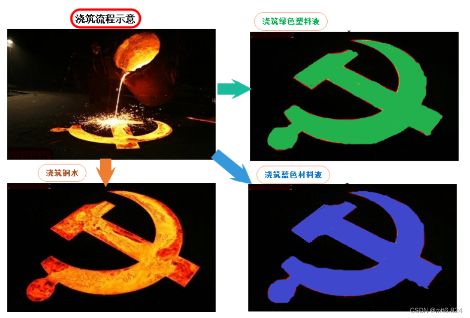

# 初识 STL：从泛型编程到标准模板库

在 C++ 的学习道路上，**STL (Standard Template Library)** 是一座绕不开的高山。它之所以被称为“标准**模板**库”，是因为它的核心灵魂正是我们之前学过的——**模板（Template）**。

今天，我们就从最基础的函数重载出发，一步步揭开 STL 的神秘面纱。

## 1. 为什么要用模板？

在接触 STL 之前，如果我们想写一个交换两个变量的函数，针对不同的数据类型，往往需要写很多重复的代码（即**函数重载**）。

这就好比工厂里的模具：
- 如果要生产铁质的零件，需要做一个铁模具；
- 如果要生产塑料的零件，又得重新做一个塑料模具。

虽然形状一样，但材料不同就得重新造轮子，效率极低。

*图：通过浇筑党徽理解函数重载与泛型思想（左侧重复制造，右侧通用模具）*

//简单的代码案例：
void Swap(int& left, int& right)
{
 int temp = left;
 left = right;
 right = temp;
}
//不同类型就需要重新进行重载
void Swap(double& left, double& right)
{
 double temp = left;
 left = right;
 right = temp;
}

而 **C++ 模板** 就像是一个**通用的精密模具**。无论倒入的是钢水、塑料液还是其他材料，只要符合规格，都能通过这个模具生产出标准的零件。这就是**泛型编程**的魅力：**编写与类型无关的通用代码**。

STL 正是建立在这个强大的基础之上。

## 2. 什么是 STL？

STL 是 C++ 标准库的重要组成部分，它提供了一套通用的数据结构和算法。你可以把它想象成一个超级自动化的**物流仓储系统**。

在这个系统中，有六个核心部件协同工作，它们分别是：

### 📦 1. 容器 (Containers)
- **角色**：仓库货架
- **作用**：用来存放数据的地方。
- **特点**：因为用了模板，所以不管是 `int`、`double` 还是你自己定义的类，都能往里塞。
- **常见成员**：`vector` (动态数组), `list` (双向链表), `map` (字典), `set` (集合)。

### 🤖 2. 算法 (Algorithms)
- **角色**：操作工人 / 机械臂
- **作用**：用来处理数据（排序、查找、遍历、统计）。
- **特点**：算法是高度通用的，它不关心货架上放的是什么，只关心怎么搬运和处理。
- **常见成员**：`sort` (排序), `find` (查找), `for_each` (遍历), `reverse` (反转)。

### 🚜 3. 迭代器 (Iterators)
- **角色**：叉车 / 传送带
- **作用**：**连接容器和算法的桥梁**。
- **核心逻辑**：算法（工人）不能直接把手伸进容器（货架）里拿东西，必须通过迭代器（叉车）来访问数据。它提供了一种统一的方式来遍历不同的容器，屏蔽了底层数据结构的差异。

### ⚙️ 4. 仿函数 (Functors)
- **角色**：定制策略 / 特殊指令
- **作用**：给算法提供具体的执行策略。
- **例子**：你要排序，是“从小到大”还是“从大到小”？这就需要一个仿函数（比如 `less<int>()` 或 `greater<int>()`）告诉算法怎么做。本质上它是重载了 `()` 运算符的类对象。

### 🔌 5. 适配器 (Adapters)
- **角色**：转接头 / 转换器
- **作用**：将一个容器的接口转换成另一个接口，或者改变算法的行为。
- **例子**：`stack` (栈) 和 `queue` (队列) 其实不是独立的容器，它们往往是基于 `deque` 或 `list` 适配出来的。

### 🛠️ 6. 空间配置器 (Allocators)
- **角色**：后勤补给 / 土地规划师
- **作用**：负责内存的分配与回收。
- **特点**：它隐藏在幕后，默默地为容器申请内存、释放内存，优化内存碎片，保证系统的高效运行。通常我们不需要直接操作它。

## 3. 总结

STL 的六大组件并不是孤立存在的，它们紧密配合：
> **空间配置器** 为 **容器** 分配内存，**容器** 存储数据，**迭代器** 将数据取出，交给 **算法** 处理，而在处理过程中，**仿函数** 提供策略，**适配器** 调整接口。

掌握了这六大部件，你就掌握了 C++ 高效编程的钥匙！接下来的文章，我们将深入每一个组件，看看它们具体是如何工作的。敬请期待喵！🐱

对了这篇文章写下来也是希望锻炼自己读文档的能力喵ヾ(=･ω･=)o